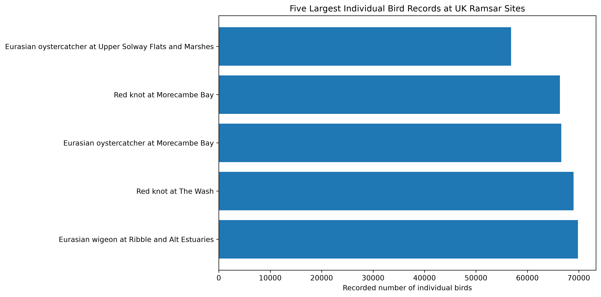
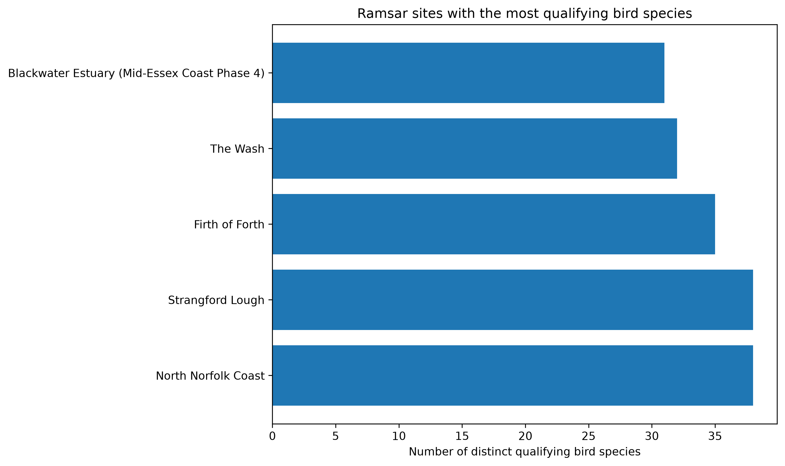
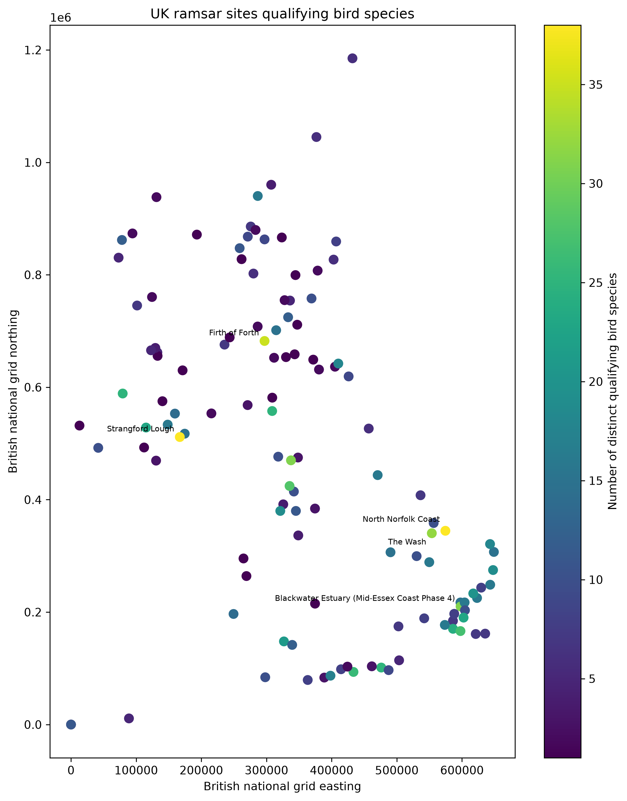

# UK Wildlife Data Project

## Project overview

This Python data-analysis project explores historical qualifying bird records for UK Ramsar wetland sites. It uses pandas to clean and summarise the data and Matplotlib to create three charts.

The analysis:

- compares the five largest individual bird records
- identifies the five Ramsar sites with the most distinct qualifying bird species
- plots Ramsar site locations using British National Grid coordinates, with colour representing the number of qualifying species

## Results at a glance







## First finding

The largest individual-species records in the dataset were associated with major coastal wetland systems. Eurasian wigeon at the Ribble and Alt Estuaries had the highest recorded five-year peak mean, at 69,841 individuals during 1998/99 to 2002/03.

All five highest records used the same unit, individuals, and the same five-year survey period. This makes those five records directly comparable.

## Species-rich sites

North Norfolk Coast and Strangford Lough had the highest number of distinct qualifying bird species in this dataset, with 38 each. They were followed by the Firth of Forth with 35, The Wash with 32, and Blackwater Estuary with 31.

The location chart shows that species-rich qualifying sites occur in different parts of the UK. However, it is a coordinate plot rather than a geographical basemap.

## Outputs

The program creates:

- `output/largest_bird_records.png`
- `output/top_ramsar_sites.png`
- `output/ramsar_site_locations.png`

## Run the analysis

```bash
python3 -m venv .venv
source .venv/bin/activate
pip install -r requirements.txt
python main.py
```

The script reads `data/wildlife.csv` and recreates all three charts in the
`output` folder.

## Data source

The source is the JNCC UK Ramsar Information Sheets structured dataset. This
repository uses the historical BirdData records supplied with that dataset.
The original JNCC resource notes that the spreadsheet has not been updated to
reflect changes made after 2015.

[View the original JNCC dataset](https://jncc.gov.uk/resources/bc9b0905-fb63-4786-8e90-5f7851bb417d)

## Important limitation

These are historical qualifying records from the JNCC UK Ramsar bird dataset. They should not be described as current bird populations or used to claim that a species is currently increasing or declining.

The dataset records qualifying features rather than every bird observed at each site. Therefore, the number of species in this analysis represents distinct qualifying species in the dataset, not total biodiversity at a site.
